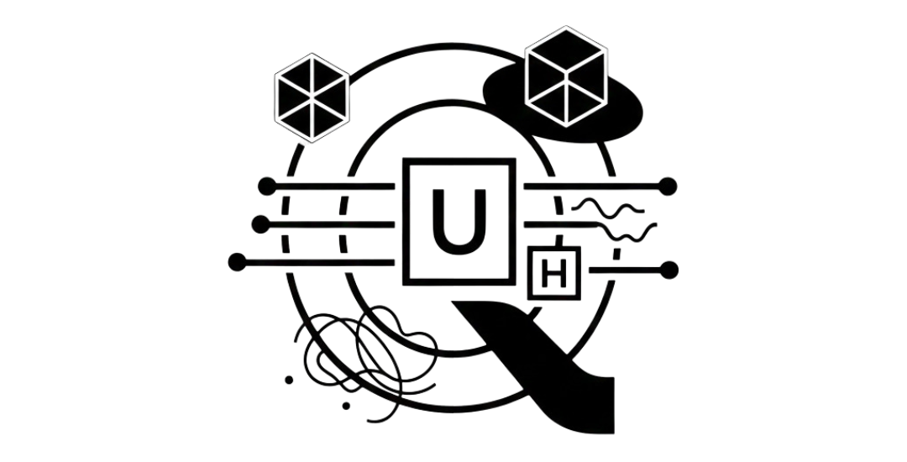

# Fundamentos de la Computación Cuántica



En este repositorio, comparto mis resoluciones de los prácticos de la materia optativa Fundamentos de la Programación Cuántica (cursada 2025).

## Pasos de Ejecución

Para ejecutar este proyecto, es necesario crear un entorno virtual para aislar las dependencias. A continuación se detallan los pasos para los principales sistemas operativos.

### 1\. Prerrequisitos

Asegúrese de tener Python instalado.

- **Windows/macOS:** Descargar desde [python.org](https://www.python.org/downloads/).
- **Linux (Ubuntu/Debian):** Es posible que necesite instalar el módulo de `venv` manualmente:

```sh
sudo apt install python3-venv
```

### 2\. Creación del entorno

Abra su terminal (o PowerShell en Windows) en la carpeta del proyecto y ejecute:

```sh
# Windows / macOS / Linux
python -m venv venv
```

> **Nota:** Si su sistema tiene múltiples versiones de Python o utiliza Linux/macOS, es probable que deba utilizar `python3` en lugar de `python`.

### 3\. Activación del entorno

Este comando varía según su sistema operativo:

**En macOS y Linux:**

```sh
source venv/bin/activate
```

**En Windows (CMD o PowerShell):**

```sh
# CMD
venv\Scripts\activate.bat

# PowerShell
.\venv\Scripts\Activate.ps1
```

> [\!TIP]
> Si en Windows PowerShell recibe un error de permisos, ejecute primero: `Set-ExecutionPolicy -ExecutionPolicy RemoteSigned -Scope Process`.

### 4\. Instalación de requerimientos

Una vez activo el entorno (verá `(venv)` al inicio de su línea de comandos), instale las dependencias:

```sh
pip install -r requirements.txt
```

### 5\. Finalización

Una vez haya terminado de trabajar con la _notebook_:

**Para desactivar el ambiente:**

```sh
deactivate
```

**Para eliminar el ambiente completamente:**

- **macOS / Linux:** `rm -rf venv`
- **Windows:** `rmdir /s /q venv`

## Creditos

Roumec, Iñaki. <iroumec@alumnos.exa.unicen.edu.ar>.
